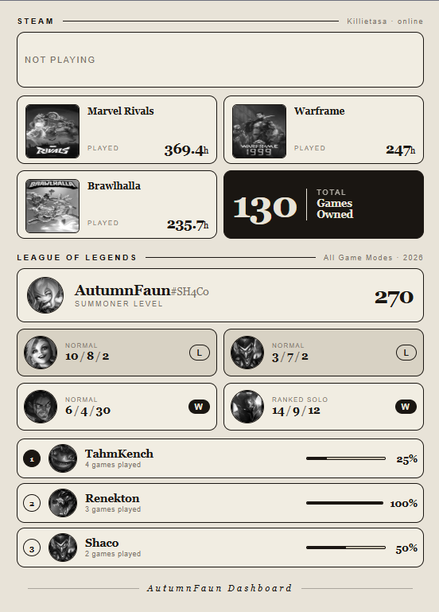

<div align="center">

# AutumnFaun Dashboard

*A personal e-ink dashboard served to a Kindle Paperwhite via its built-in web browser*

[](https://nextjs.org)
[](https://www.typescriptlang.org)
[](https://www.docker.com)
[](https://steamcommunity.com/dev)
[](https://developer.riotgames.com)
[](https://developer.spotify.com)

</div>

---

## What is this?

A self-hosted web dashboard that runs on a **Kindle Paperwhite** acting as an always-on status display. The Kindle sits on a desk with its browser open in fullscreen, showing Steam activity and League of Legends stats — refreshing automatically, no interaction needed.

The main app is a full React/Next.js dashboard for modern browsers. For the Kindle, a dedicated `/kindle` route serves a zero-JavaScript, pre-rendered HTML page that even the oldest WebKit browser can handle.

<div align="center">



</div>

---

## The Rendering Challenge — How to Make It Work on a Kindle

Getting a web app to display correctly on a Kindle is not straightforward. The Kindle Paperwhite ships with an old WebKit-based browser with significant limitations:

- **No modern JavaScript runtime** — React, hydration, and client-side hooks are too heavy for the hardware
- **No reliable CSS Grid / Flexbox** — older browser versions ignore or misrender modern layout CSS
- **Slow CPU and very limited RAM** — even a lightweight JS bundle can freeze or crash the browser
- **Client-side API calls are a problem** — fetching multiple external APIs from the browser adds latency on already sluggish hardware, and any JS error kills the whole page

### Approaches Considered

| Approach | Pros | Cons | Verdict |
|---|---|---|---|
| **Regular React page** | Already built | Too heavy for Kindle; JS crashes | ❌ |
| **PNG screenshot (Puppeteer)** | Perfect visual match | Requires headless Chrome on server; heavy dependency | ❌ |
| **Next.js ISR** | Static-ish output | Still ships a React bundle the Kindle has to execute | ❌ |
| **Pure HTML route** | Zero JS, works on any browser | No interactivity (acceptable for a dashboard) | ✅ |

### The Solution

A dedicated `/kindle` route handler that:

1. **Fetches all data server-side** using a TTL cache (`STEAM_UPDATE_RATE`, `LEAGUE_UPDATE_RATE`) so the Kindle browser never makes a single external API call
2. **Renders a complete HTML string** with inline styles, `<table>`-based grids, and fixed-pixel image dimensions — no CSS classes, no external stylesheets, no JavaScript
3. **Returns `text/html`** with a `<meta http-equiv="refresh">` tag so the page auto-reloads at the configured interval
4. **Proxies all images** through `/api/image-proxy`, which converts them to grayscale PNG on the server with Sharp — the Kindle e-ink display only shows grey anyway
5. **Uses relative image URLs** (`/api/image-proxy?url=...`) so images always resolve correctly regardless of how the server is accessed — localhost in dev, LAN IP in Docker, behind a reverse proxy, etc.

The visual design matches the React dashboard component-by-component — same color palette, same typography, same layout — rendered as static HTML instead of React.

### Kindle Setup

> **Prerequisite:** The Kindle must be jailbroken to install the fullscreen browser. The steps below assume you've already got the server running locally or via Docker.

1. **Get the server running** — follow the [Running Locally](#running-locally) or [Running with Docker](#running-with-docker) steps below until the dashboard is accessible at `http://localhost:3000` or your LAN IP.

2. **Jailbreak your Kindle** — ([video walkthrough](https://youtu.be/l4ZliC82RtA?si=FmbEArpWFKxcYqRo) · [jailbreak documentation](https://kindlemodding.org/kindle-models.html))
   My device was on firmware **5.18.1** and I used [**AdBreak**](https://github.com/notmarek/adbreak) to jailbreak it.

3. **Install KUAL and the Fullscreen Web Browser** — after jailbreaking and installing KUAL, download the fullscreen browser extension:
   [https://kindlemodshelf.me/fullscreenweb](https://kindlemodshelf.me/fullscreenweb)

4. **Configure the URL** — edit `shortcut_browser.sh` inside the downloaded package and replace the example URL with your server address:
   ```
   YOUR_SERVER_IP:3000/kindle
   ```

5. **Copy files to the Kindle** — connect the Kindle via USB and copy the browser files into the `documents` folder at the root of the device.

6. **Launch** — open the Kindle, tap **"Shortcut Browser"** in KUAL, and the dashboard loads fullscreen.

---

## Alternative: TRMNL + KOReader

[TRMNL](https://usetrmnl.com/) is a cloud-based e-ink dashboard service. Combined with [KOReader](https://koreader.rocks/) — open-source reader software that runs on Kindle, Kobo, PocketBook, and other devices — it provides a simpler setup path that skips the jailbreak entirely.

| Approach | Setup | Hardware | Offline? |
|---|---|---|---|
| **Fullscreen browser** (Kindle jailbreak) | Medium — jailbreak + KUAL required | Kindle Paperwhite | ✅ LAN only |
| **TRMNL + KOReader** | Low — cloud service handles rendering | Any KOReader-compatible e-ink device | ❌ Needs internet |

### How it works

1. TRMNL polls your server's `/api/trmnl` endpoint for JSON data (Steam + League)
2. TRMNL renders the plugin's Liquid template on its cloud infrastructure (modern browser, full CSS support)
3. The rendered image is pushed to your KOReader device via TRMNL's BYOD client

### Setup

See [`trmnl-plugin/README.md`](trmnl-plugin/README.md) for step-by-step plugin configuration.

---

## Features

| Section | Details |
|---|---|
| 🎮 **Steam** | Online status · Now Playing card with game art · Top 3 games with hours played · Total library count |
| 🏆 **League of Legends** | Summoner profile · Last 4 matches with queue type, KDA and W/L badge · Top 3 champions with winrate bar |
| 🎵 **Spotify** | Compact now-playing card with album art and progress bar *(see note below)* |

---

## ⚠️ Spotify — Work in Progress

Spotify integration is **WIP**. The full experience — live player, synced lyrics, playback controls — is available at `/spotify` and requires a modern browser capable of running React and polling the API client-side.

**The `/kindle` route shows a static Spotify card only when a track is actively playing at page-load time.** Because the Kindle page has no JavaScript, it cannot poll for changes; the card only updates when the meta-refresh fires (every 60 seconds).

> **Spotify on `/kindle` only works reliably on newer Kindle models** whose browsers can handle the OAuth callback and modern HTTPS correctly. Older Kindles that depend on the `/kindle` static route will not see Spotify data — the section is simply omitted when no refresh token is configured.
>
> For the full Spotify experience (controls, lyrics, live progress), use a modern browser at `/spotify`.

---

## Tech Stack

- **Next.js 16** — App Router, route handlers, standalone Docker output
- **TypeScript** — strict mode throughout
- **Tailwind CSS v4** — main dashboard styling
- **Sharp** — server-side grayscale image conversion via `/api/image-proxy`
- **Steam Web API** — player summary, owned games, now playing
- **Riot Games API** — account lookup by Riot ID, match history, summoner data
- **Data Dragon** — champion images and profile icons
- **Spotify Web API + LRCLIB** — currently playing track, synced lyrics
- **Docker** — multi-stage build with Sharp native binaries for Alpine

---

## Running Locally

```bash
# 1. Install dependencies
npm install

# 2. Fill in environment variables
cp .env.example .env   # edit .env with your API keys

# 3. Start the dev server
npm run dev
```

| URL | Description |
|---|---|
| `http://localhost:3000` | Main React dashboard |
| `http://localhost:3000/kindle` | Kindle-optimized static HTML view |
| `http://localhost:3000/spotify` | Full Spotify player |
| `http://localhost:3000/api/spotify/auth` | Start Spotify OAuth flow |

## Running with Docker

```bash
docker compose build
docker compose up -d
```

The server starts on port `3000`. Access the Kindle route from any device on the same network at `http://<host-ip>:3000/kindle`.

---

## Environment Variables

| Variable | Description | Default |
|---|---|---|
| `STEAM_API_KEY` | Steam Web API key | — |
| `STEAM_ID` | Your Steam 64-bit ID | — |
| `LEAGUE_API_KEY` | Riot Games API key *(dev keys expire every 24 h)* | — |
| `RIOT_ID` | Your Riot ID in `Name#TAG` format | — |
| `SPOTIFY_API_CLIENT_ID` | Spotify app client ID | — |
| `SPOTIFY_API_CLIENT_SECRET` | Spotify app client secret | — |
| `SPOTIFY_REFRESH_TOKEN` | OAuth refresh token *(obtained via `/api/spotify/auth`)* | — |
| `LRCLIB_API_URL` | LRCLIB lyrics API base URL | `https://lrclib.net/api/` |
| `STEAM_UPDATE_RATE` | Steam cache TTL and Kindle refresh interval (seconds) | `60` |
| `LEAGUE_UPDATE_RATE` | League cache TTL (seconds) | `600` |
| `SPOTIFY_UPDATE_RATE` | Spotify polling interval for main dashboard (seconds) | `10` |

> **Riot API note:** development keys expire every 24 hours. The app resolves accounts by Riot ID (`Name#TAG`) via the Account API — no encrypted summoner ID needs to be stored or updated when the key rotates.

---

## Roadmap

- [ ] Fix and complete Spotify integration — live now-playing on `/kindle` with proper OAuth handling for older Kindle browsers
- [ ] Data persistence — cache last successful API responses so the dashboard survives temporary API failures or network blips
- [ ] Partial screen update — refresh only changed sections instead of full-page reloads, to reduce e-ink flicker

---

<div align="center">

*Built for a Kindle Paperwhite sitting on a desk*

</div>
